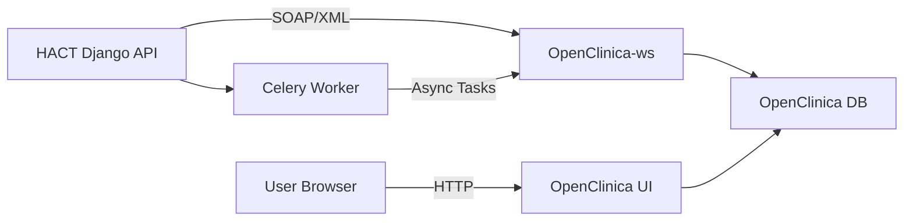

# Django ↔ OpenClinica EDC Integration Guide

## Architecture Overview



**Django is the master system.** OpenClinica acts as a satellite EDC (Electronic Data Capture). Data flows **one-way**: Django → OpenClinica.

### How It Works

| Layer | What | File |
|---|---|---|
| **SOAP Client** | Builds XML, sends to OC Web Services | [openclinica.py](file:///c:/Users/hello/Desktop/HACT%20project/backend/integrations/openclinica.py) |
| **Celery Tasks** | Async wrappers with retry logic | [tasks.py](file:///c:/Users/hello/Desktop/HACT%20project/backend/integrations/tasks.py) |
| **Management Cmd** | Quick connectivity test | [test_openclinica.py](file:///c:/Users/hello/Desktop/HACT%20project/backend/integrations/management/commands/test_openclinica.py) |

### Integration Functions Available

| Function | Purpose | OC SOAP Service |
|---|---|---|
| `is_available()` | Health check — is OC running? | HTTP GET to MainMenu |
| `list_studies()` | List all studies in OC | StudyService.listAll |
| `create_study_subject()` | Enroll a subject in OC | StudySubjectService.create |
| `list_study_subjects()` | List subjects in a study | StudySubjectService.listAllByStudy |
| `schedule_event()` | Schedule a visit event | EventService.schedule |
| `import_data_odm()` | Import form data via ODM XML | DataImportService.import |

---

## What's Verified Working ✅

| Test | Status |
|---|---|
| OC container boots and is healthy | ✅ |
| OC database has 122 tables (Liquibase) | ✅ |
| OC login page accessible at `localhost:8088` | ✅ |
| Django `is_available()` returns `True` | ✅ |
| NGINX proxies `/OpenClinica/` correctly | ✅ |
| Django integrations app loads | ✅ |
| SOAP envelope builder works | ✅ |
| Password now hashed with SHA-1 (required by OC) | ✅ |

---

## ⚠️ One-Time Setup Required (YOU must do this)

OpenClinica requires **two things** before the SOAP Web Services will authenticate:

### Step 1: Set Your OC Password in `.env`

When you first logged into OpenClinica, you were prompted to change the default password (`12345678`). The SOAP client needs that **exact password**.

Edit [.env](file:///c:/Users/hello/Desktop/HACT%20project/.env) line 72:

```env
OPENCLINICA_ADMIN_PASSWORD=YOUR_ACTUAL_PASSWORD_HERE
```

Then recreate Django:

```powershell
docker compose --profile openclinica up -d --force-recreate django-api
```

### Step 2: Enable SOAP Web Services for root user

1. Open **http://localhost:8088/OpenClinica/**
2. Login with `root` / your password
3. Go to **Tasks** → **Administration** → **Users**
4. Click **Edit** next to the `root` user
5. ✅ Check **"Authorize SOAP web services in this account"**
6. Click **Save**

> [!IMPORTANT]
> Without this checkbox, ALL SOAP calls will fail with "Authentication Failed" — even with the correct password!

### Step 3: Verify

```powershell
docker exec hact-django-api python manage.py test_openclinica
```

**Expected output:**
```
Testing OpenClinica connection...
  URL: http://openclinica:8080/OpenClinica
  WS:  http://openclinica:8080/OpenClinica-ws

✅ OpenClinica is REACHABLE

Listing studies in OpenClinica...
  No studies found (OpenClinica is empty — ready for sync)

✅ OpenClinica integration test complete.
```

If `list_studies()` returns no error → SOAP authentication works! No studies yet because OC is fresh.

---

## Testing the Full Integration Flow

Once Steps 1-3 above are done, here's how to test the complete data flow:

### Test 1: Create a Study in OpenClinica

1. Login to OC at **http://localhost:8088/OpenClinica/**
2. Go to **Build Study** → **Create Study**
3. Fill in:
   - Study Name: `HACT Test Study`
   - Protocol Number: `HACT-001`
   - Unique Protocol ID: `HACT-001`
4. Save the study
5. Verify from Django:

```powershell
docker exec hact-django-api python manage.py test_openclinica
```

Should now show: `📋 HACT-001: HACT Test Study`

### Test 2: Health Check Task (Celery)

```powershell
docker exec hact-django-api python -c "
import os; os.environ.setdefault('DJANGO_SETTINGS_MODULE','hact_ctms.settings')
import django; django.setup()
from integrations.tasks import check_openclinica_health
result = check_openclinica_health.delay()
print('Task ID:', result.id)
import time; time.sleep(5)
print('Result:', result.get(timeout=10))
"
```

**Expected:** `{'status': 'healthy', 'studies_count': 1}`

### Test 3: Verify Django → OC Connectivity (is_available)

```powershell
docker exec hact-django-api python -c "
import os; os.environ.setdefault('DJANGO_SETTINGS_MODULE','hact_ctms.settings')
import django; django.setup()
from integrations.openclinica import is_available
print('OC Available:', is_available())
"
```

**Expected:** `OC Available: True`

---

## How the Sync Will Work in Production

When implemented fully, the data flow will be:

```
1. User creates Subject in HACT Django frontend
      ↓
2. Django signal fires → Celery task: sync_subject_to_openclinica
      ↓
3. Celery task calls create_study_subject() via SOAP
      ↓
4. Subject appears in both Django DB AND OpenClinica
      ↓
5. User submits CRF form in Django
      ↓
6. Django signal fires → Celery task: sync_form_data_to_openclinica
      ↓
7. Celery sends ODM XML via import_data_odm()
      ↓
8. Form data appears in OpenClinica EDC
```

> [!NOTE]
> The sync is **one-way** (Django → OC) and **async** (via Celery). If OC is offline, tasks retry automatically every 60 seconds up to 3 times.

---

## Troubleshooting

### OC shows "unhealthy" after Docker restart
```powershell
# Clear Liquibase stale lock
docker exec hact-oc-postgres psql -U clinica -d openclinica -c "UPDATE databasechangeloglock SET locked=false, lockgranted=null, lockedby=null WHERE id=1;"
docker restart hact-openclinica
# Wait 4 minutes
```

### SOAP returns "Authentication Failed"
1. Check password in `.env` matches your OC login password
2. Enable SOAP WS for the user in OC Admin → Users → Edit → checkbox
3. Recreate Django: `docker compose --profile openclinica up -d --force-recreate django-api`

### "No studies found"
This is normal for a fresh OC install. Create a study in the OC UI first.
